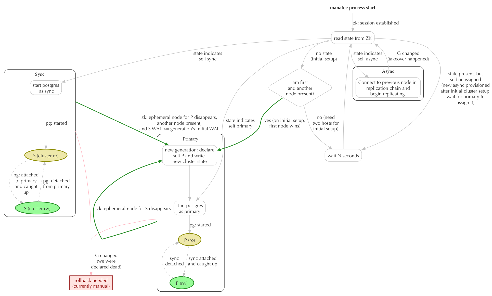

# Manatee state machine

[Manatee](https://github.com/joyent/manatee) is a component of Joyent's
[SmartDataCenter](https://github.com/joyent/sdc) and
[Manta](https://github.com/joyent/manta) projects.

This repo contains design docs and implementation pieces for the state machine
guts of Manatee version 2.

## Introduction

This document attempts to describe the upcoming Manatee changes relatively
formally to help us understand the various cases that need to be considered for
the implementation.

Recall that Manatee is a cluster of three or more postgres instances such that:

* One member of the cluster, the *primary*, serves all reads and writes
* The primary uses synchronous replication to a postgres instance called the
  *sync peer*, meaning that transactions are not committed to the client until
  they've been committed to the sync's transaction log
* Attached to the synchronous peer is a daisy chain of one or more *async
  peers*, which replicate changes from the previous link in the chain.  They're
  asynchronous because it's not necessary for this replication to complete
  before transactions are committed.
* If possible, the system automatically reconfigures itself after any
  combination of failures (of peers, the ZK cluster, or the underlying network)
  to maximize uptime and to never lose data.

Any configuration of three or more peers can use the algorithm described here.
Manatee can be operated in single-peer mode; details on that are described under
"One-node-write mode" below.  Two-peer mode is analogous to two manatee nodes
with no async (a degraded state).  Operationally this mode does not make sense
with this algorithm since it will never failover (the sync will never attempt a
takeover without an async).

There are two state machines here.  There's an overall cluster state, which is
ultimately "unavailable", "read-only", or "read-write", and has an additional
property of "requires operator attention" (which can be true even when
read-write).  This is ultimately what we care about.  But being a distributed
system, this state machine is actually determined by a different state machine
executed independently by each peer.  The point is to design the individual
state machine such that the resulting cluster state machine does what we want
(maximizes availability without ever losing data).

## Cluster state

In this model, *all* state related to the configuration of the cluster is stored
inside ZooKeeper.  There are two kinds of state stored in ZooKeeper:

**Ephemeral state**: when each node establishes its ZK session, it creates an
ephemeral node that identifies itself.  These nodes are implicitly ordered by
ZK.  When the node's session is expired by ZK (e.g., as a result of prolonged
disconnection), the ephemeral node is removed, and all peers with established
ZK sessions are notified.  In implementation, this means that for each manatee
cluster, there will be a single directory containing the ephemeral nodes for
each peer.  These nodes are created when each peer's session is established, and
node's will watch this directory to be notified of peers coming and going.

**Cluster state**: the cluster state is a single, non-ephemeral object whose
contents are a JSON object that includes:

* **G**, a generation number
* **P**, the hostname (or other identifier) for the current primary peer
* **S**, the hostname (or other identifier) for the current sync peer.  Note
  that this is the peer *assigned* to be the sync, but in general it may not
  be caught up to the primary (P) when the generation begins.
* **A[]**, an ordered list of async peers, where the order defines the
  replication order
* **init\_wal**, the current position (a monotonically increasing integer) in P's
  WAL when the current generation began

Notes on cluster state:

* The cluster moves atomically from one generation to the next, though obviously
  not all peers discover the change atomically.
* When a new generation is **declared**, the primary for that generation writes
  out a complete cluster state that contains G, P, S, A, and init\_wal.  All
  of these fields except for "A" will be immutable for the duration of this
  generation.
* The first generation is declared when there is no previous generation and there
  are at least two peers' ephemeral nodes present.  This generation is declared
  by the peer whose ephemeral node is "first" according to ZK.  The ordering
  here doesn't matter, since all peers are equivalent at this point.
* Subsequent generations may be declared in exactly two situations:
    * The primary for generation G may declare a new generation G+1 if it
      determines that S has failed (because S's ephemeral node disappears) *and*
      at least one async from A is still present.  P will select a new S from
      the head of A and declare a new generation.  If the old S comes back, it
      will see that it is no longer S.
    * The secondary for generation G may declare a new generation G+1 if it
      determines that P has failed (because P's ephemeral node disappears) *and*
      at least one async from A is still present *and* its own WAL log
      position is at least as large as "init\_wal".  If S's WAL position is less
      than "init\_wal", then S was never fully caught up to P and the system
      cannot proceed until P returns or an operator intervenes.
* When a generation is initially declared, S is usually not yet caught up to P.
  The cluster may be made available read-only, but it's not until S establishes
  synchronous replication and fully catches up to P that the cluster can be made
  available read-write.

As a result of these rules, we can say that:

* Exactly one peer will successfully write the initial cluster state.
* In generation G, the only peer that can write a new cluster state G+1 is the
  primary assigned for G+1.  The only two nodes that could attempt to do this
  are the P or S from generation G.  It would be extremely unlikely for them to
  do this at the same time, since both of them will only do this when
  determining that the other's ZK session has expired, but we will use a
  test-and-set operation to make sure that only one of them can successfully do
  this.
* Additionally, every new generation of cluster state includes a valid
  assignment of P, S, and A such that:
    * P can replicate to S
    * S can replicate to A0
    * Ai can replicate to A(i+1)
  which also means that P is at least as far ahead as any other peer, which
  means that we never lose data.

## Algorithm overview

## Algorithm

1. On startup, connect to the ZK cluster, establish a session, and create the
   ephemeral node that represents this peer.  Set a watch on the cluster state
   object.
2. If at any point the ZK session expires, go back to step 1.
3. If at any point the cluster state changes, reread it.  If G has changed, go
   back to step 1.
4. Read the current cluster state.
    1. If there is no current state, then the cluster may have never been set
       up.
        1. If postgres has been set up in the past on this node, wait for a
           few seconds and go to step 1.  This indicates migration.
        2. If there are other ephemeral nodes in the cluster, and our ephemeral
            node is the first one according to the ZK-defined order, then go to
            "Declaring a generation" below.
        3. Otherwise, wait a few seconds and go to step 1.
    2. If the current state indicates that we are the primary, then go to
       "Assume the role of primary" below.
    3. If the current state indicates that we are the sync, then go to "Assume
       the role of sync" below.
    4. If the current state indicates that we are an async, then go to "Assume
       the role of async" below.
    5. Otherwise, we must be a newly-provisioned node.  We will become an async,
       but we will wait for the current primary to assign our upstream.  Wait a
       few seconds and go to step 1.

### Declaring a generation

A new generation is declared in one of three cases:

* during initial cluster setup (when there's no cluster state), by the peer with
  the lowest-ordered ephemeral node, when there's at least one other peer
  present;
* when a sync S in generation G declares that P has failed, and S has caught up
  to where P was at the start of generation G, and there's another async A0
  available to become the new S;
* when a primary P in generation G declares that S has failed and selects an
  async A0 to become the new S

In all of these cases, the generation is declared by the node that will be P in
the new generation, and it only does so when there's a node present that can be
assigned as S.  As a result, the new cluster state is derived as:

* **G**: one more than the previous generation
* **P**: the peer declaring the new generation
* **S**: at initial setup, this is any other available node.  Afterwards, this
  is A0, the first async peer.
* **A**: the ordered list from the previous generation with A0 (the head of the
  list) removed
* **init\_wal**: the current position in P's WAL

This state is written with a test-and-set operation over the original state.  If
that fails, go to step 1 of the algorithm above.  If this operation succeeds,
proceed to "Assume the role of primary" below.

### Assume the role of primary

1. Start postgres as primary, meaning that it's configured for synchronous
   replication.  When postgres starts, it will become read-only.
2. Wait for the synchronous peer to attach.  When it attaches and catches up,
   postgres will become read-write.
3. If it's detected that G has changed (which can only happen if S has declared
   a new generation), stop postgres and proceed to step 1 in the main algorithm
   above.  This will likely require a rollback, which is currently a manual
   step.
4. If S's ephemeral node goes away, declare a new generation (see above).

### Assume the role of secondary

1. Start postgres as the secondary, meaning that it's configured for async
   replication, and it's configured to replicate synchronously from the primary.
   When postgres starts, it will connect to the primary and begin replication.
2. When replication catches up to the primary, postgres on the primary will
   become read-write (see above).
3. If it's detected that G has changed (which can only happen if P has declared
   a new generation), stop postgres and proceed to step 1 in the main algorithm
   above.
4. If P's ephemeral node goes away, declare a new generation (see above).

### Assume the role of async

1. Find our entry in the list A of async peers.  The previous entry (or S, if
   we're the first entry in A) is our upstream source.  Begin replicating from
   the upstream source.
2. If A changes, then go to step 1.
3. If G changes, then go to step 1 in the main algorithm above.

### Async peer management

The primary has to maintain the list of async peers, and it should try to avoid
shuffling the order so that the replication chain flows down the line of asyncs.

When a new async joins, it creates its ephemeral node.  When the primary sees
that, it appends the async to A in the cluster state.  When the async sees
that, it begins replicating from the previous A, or from S if it's at the head
of A.  If the async goes away, the primary removes it from A.  The peer
behind the peer that failed must notice this and begin replicating from the next
upstream peer.

### Deposed peers

When a primary is deposed, in some cases it may be possible for the primary to
resume service as an async without further intervention, but it many cases this
is not possible.  (That's because when a takeover event occurs under load, the
primary will typically have xlog entries not present on the other peers.  These
entries correspond to uncommitted transactions.  Once the cluster starts taking
writes after the takeover, the deposed peer's transaction log actually diverges
from the actual cluster's log -- i.e., both have entries for xlog position X,
but they're different.  This is only recoverable by rolling back the primary.)

Since the common case in production is that this will not be possible, primary
peers that are deposed move into an explicit "deposed" state, and the only way
to remove them from this state is by manual action that rebuilds the primary
from one of the other peers.  This operation is documented in the user guide.

When a peer is deposed, it shuts down its postgres instance and waits for
operator intervention.

## ZK sessions

From each peer's perspective, the only events related to ZK are:

* **connected**/**disconnected**: These are both nops.  ZK is based around
  sessions to avoid transient TCP failures triggering cluster reconfigurations.
* **session established**: Client should re-read cluster state and proceed as
  during initial startup.
* **session expired**: Client should attempt to establish a new session (and
  then see "session established").
* **client timeout** (client has failed to heartbeat in too long): This is a
  nop.  It will eventually result in a session expiration or a normal
  reconnection.

## One-node-write mode (ONWM)

Manatee supports limited use of one-node-write mode, which means that a single
peer is allowed to become a writable primary with no replication attached.
There are two main cases where this is used:

* during bootstrap of SmartDataCenter, where a writable Manatee peer is required
  for deployment of a second Manatee peer, after which the cluster will be
  switched into normal mode
* for tiny non-production deployments where the added durability of a full
  cluster is not important and the resources required to run it are not
  available but the surrounding architecture assumes the presence of Manatee.
  This is true for the SDC COAL deployment, which is a tiny SDC instance used
  for development and testing.

The expectation is that ONWM clusters only have one peer.  The only time other
peers are expected to show up is in preparation for transitioning the cluster to
normal mode.  In ONWM, ZooKeeper is still used to record cluster state, but an
additional field called "oneNodeWriteMode" will be true, the cluster will be
frozen, and the "sync" field will be null.

To enable this mode, a peer must be configured with ONWM enabled and the cluster
must not have previously been set up.  Once that happens:

* When the peer starts up, it will immediately set up the cluster for
  one-node-write mode, with itself as the primary.  (In normal mode, it would
  wait for another peer to show up before setting up the cluster.)
* The primary peer in ONWM will not react to any other peers joining the
  cluster.  It will never assign a sync, assign asyncs, or declare
  new generations.
* Since other peers joining the cluster will never be assigned as syncs, let
  alone asyncs, they will never attempt to take over from the primary.

To transition a cluster into normal mode:

1. Deploy a new peer *not* configured for ONWM.  This peer will immediately
   become unassigned.
2. Disable the primary peer.
3. Reconfigure the primary peer to disable ONWM.
4. Enable the primary peer.
5. Unfreeze the cluster.

The primary will come up as primary, see that the cluster must be transitioning
to normal mode, and declare a new generation with the newly-deployed peer as the
sync.  After that, the cluster behaves like a normal cluster.

## Planned promotions

A topology change in Manatee takes place when the cluster determines that a peer
has gone missing and another peer is available to takeover in that role.  This
is done by watching for changes to the active peers (i.e. the presence of their
ephemeral nodes in ZooKeeper), but depending on ZooKeeper configuration this
could be a lengthy period of time before the cluster notices.  For situations
where a known topology change is going to happen (e.g. when upgrading the
cluster), Manatee will watch for a special object in ZooKeeper and proactively
take actions on the request, instead of waiting for a timeout of the applicable
ephemeral node.

This object is named `promote` in the cluster's state and is described below in
the "Data structures" section.  When an operator puts this object, each peer in
the cluster will get a "clusterStateChange" event and, as part of its evaluation
of this state, validate the promotion request against the current state of the
cluster.  If this request is invalid, the request is ignored and a message
logged.  If this request is valid, the primary (or in the event of a deposition
of the primary, the sync) will put a new state object into ZooKeeper reflecting
the intended state of the cluster (e.g. new primary required, async chain
changes).  Each peer will then receive a subsequent "clusterStateChange"
notification and take the appropriate actions defined in this state.

The original `promote` object will not be re-written to the cluster's state when
a promotion request is acted upon.  When the promotion request is invalid, the
object will remain in the cluster's state until removed by either the operator
or a subsequent change in cluster state.

The cluster will never act on a promotion request where the current time is
greater than that in the `promote.time`, or in the case where any other of the
properties do not match the current state of the cluster (e.g. if
`promote.generation` doesn't match `clusterState.generation`).  This has the
effect of protecting the cluster from acting on a promotion request where there
might have been a natural takeover in the time between when the operator was
building this object and putting it into ZooKeeper.

# Implementation notes

## Data structures

### peer identifier

Several parts of the interface refer to individual manatee peers.  Identifiers
are non-null objects with several properties:

* `id` (string): an immutable, unique identifier for this peer.  For backward
   compatibility reasons the format is `ip:postgresPort:backupPort`.
* `pgUrl` (string, postgres URL): URL for contacting the postgres peer.  This is
  unique.
* `backupUrl` (string, http URL): URL for requesting a backup from this
  peer.
* `zoneId` (string): the hostname of the manatee peer, for operator reference
  only.  This is not guaranteed to be unique, and should not be used
  programmatically.
* `ip` (string, IPv4 address): an IP address for the manatee peer, for operator
  reference only.  This is not guaranteed to be unique, and should not be used
  programmatically.

**The state machine implementation does not interpret any of these fields.  For
comparing the identities of two peers, only the `id` field is used.**

### clusterState

`clusterState` is an object.  If not initialized in ZK, its JavaScript value is
`null`.  Otherwise, it has these properties:

* `generation` (integer): generation number
* `primary` (peer identifier): the primary peer
* `sync` (peer identifier, see above): the synchronous replication peer
* `async` (array of peer identifiers, see above): the list of asynchronous
  peers, in replication order.  That is, `async[i]` replicates from
  `async[i-1]`, and `async[0]` replicates from `sync`.
* `deposed` (array of peer identifiers, see above): the list of previous
  primaries which need to be rebuilt before being brought back into service
* `initWal` (string, postgres WAL location): the WAL of the primary when this
  generation began.
* `freeze`: if this field is present and non-null, then no peers should make any
  changes to the cluster state (including both takeovers and incorporating new
  async peers).  If present, it may be a boolean or an object describing who
  froze the cluster and why.  This is currently used during migration from older
  versions.
* `oneNodeWriteMode`: if true, then the cluster is configured for one-node-write
  mode.  See above for details.
* `promote`: an optional object containing the intent of an operator-initiated
  promotion for an individual peer.  See below for details.

#### clusterState.promote

`promote` is an optional object that is validated separately to the clusterState
object.  Its properties are expected to be as follows:

* `id` (string): id of the peer to be promoted (see "peer identifier")
* `role` (string): current role of the peer to be promoted
* `asyncIndex` (integer): position in the async chain (if "role" is "async")
* `generation` (integer): generation of the cluster that the promotion is taking
  place in
* `expireTime` (string): time that a promotion must happen within in the format
  that jsprim's `parseDateTime` method will accept

### pg config

`pg config` is a non-null object representing postgres configuration.  It always
has this properties:

* `role` (string): one of `'primary'`, `'sync'`, `'async'`, or `'none'`.

If `role` is `'primary'`, then there's a `'downstream'` property which is a
manatee peer identifier (see `peer identifier` above).  In this case, the
`upstream` property is `null`.

If `role` is `'sync'` or `'async'`, then there's an `'upstream'` property which
is a manatee peer identifier (see `peer identifier` above).  In this case,
the `downstream` property is `null` (even though there may be a downstream,
because this information is not part of the postgres configuration for this
peer).

If `role` is `'none'`, then replication is not configured at all, and
`'upstream'` and `'downstream'` are both null.

For examples:

    {
        "role": "primary",
        "upstream": null,
        "downstream": {
            "id": "10.77.77.7:5432:12345",
            "pgUrl": "tcp://postgres@10.77.77.7:5432/postgres"
            "backupUrl": "http://10.77.77.7:12345",
            "zoneId": "3360a2f9-4da3-476f-9fb0-915b9f01fecd",
            "ip": "10.77.77.7"
        }
    }

    {
        "role": "sync",
        "upstream": { "id": "10.77.77.7:5432:12345", ... }
        "downstream": null
    }

    {
        "role": "none",
        "upstream": null,
        "downstream": null
    }

## Interfaces

There are two interfaces used by the state machine implementation: the ZK
interface and the postgres interface.

### ZK interface

**Methods**:

* `putClusterState(clusterState, callback)`: does a test-and-set write to the
  cluster state node in ZK using the given `clusterState` object for the new
  contents.  On success, invokes `callback` with no arguments.  On failure,
  invokes `callback` with an Error describing the problem.

**Events**:

* `init` (arg `status`): emitted once for the lifetime of this event emitter.
  It has two properties: (1) `clusterState` is the cluster state found, an
  object of type `clusterState` (see above) and (2) `active`, the list of active
  peers in Zookeeper.  **This is always the first event emitted by this
  object.**
* `clusterStateChange` (arg `clusterState`): emitted any time the `clusterState`
  ZK node changes.
* `activeChange` (arg `allActive`): emitted once, immediately after the first
  `init` event, and again any time the directory of ephemeral nodes
  (representing the set of peers in this cluster with active ZK sessions)
  changes.  `allActive` is an array of `peer identifier`s.

### PG interface

**Methods**:

**All three of these are asynchronous`.  None of these methods may be called
while any asynchronous operations on the interface are outstanding.**

* `reconfigure(pgConfig, callback)`: reconfigures postgres replication according
  to the given configuration (see `pg config` above).  Invokes `callback` on
  completion, with no arguments on success and an Error on failure.  This does
  not start or stop postgres.  The caller must do that separately.
* `start(callback)`: starts postgres with the last configuration specified to
  `reconfigure`.  Invokes `callback` on completion, with no arguments on success
  and an Error on failure.
* `stop(callback)`; stops postgres.  Invokes `callback` on completion, with no
  arguments on success and an Error on failure.

There are these additional methods:

* `getXLogLocation(callback)`: Fetches the last known Xlog position from
  Postgres and returns it asynchronously to `callback`.  May return an error
  to `callback` instead.  May fail (with an asynchronous, operational error) if
  postgres is not online.

**Events**:

* `init`: emitted when the interface is ready with a struct indicating postgres
  status: `online` indicating if postgres is already running and `setup`,
  indicating if postgres has been previously set up on this node.
